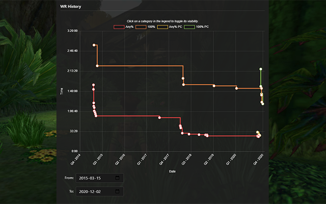

# SRC-wrChart-Zoom
Adds simple, browser native, From and To date fields under the WR chart  

Gain the ability to zoom  in the WR History chart on speedrun.com with a simple, browser native, From and To date fields located right under the chart.  
The extension works by filtering out values outside the select range.  

The code is very light and does not include any custom styling or external library. I intend to keep this a simple, small project, but if you do find any issue, please let me know over at: https://github.com/Avasam/SRC-wrChart-Zoom/issues  

|||
|-|-|
